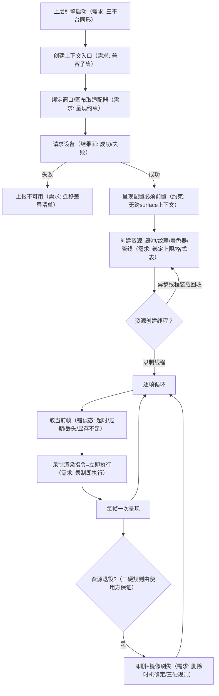

# pi-wgpu-rebuild · 业务流程图（L1）

```mermaid
flowchart TD
  A["上层引擎启动（需求: 三平台同形）"] --> B["创建上下文入口（需求: 兼容子集）"]
  B --> C["绑定窗口/画布取适配器（需求: 呈现约束）"]
  C --> D["请求设备（结果面: 成功/失败）"]
  D -->|失败| D1["上报不可用（需求: 迁移差异清单）"]
  D -->|成功| E["呈现配置必须前置（约束: 无跨surface上下文）"]
  E --> F["创建资源: 缓冲/纹理/着色器/管线（需求: 绑定上限/格式表）"]
  F --> G{"资源创建线程？"}
  G -->|录制线程| H["逐帧循环"]
  G -->|异步线程装载回收| F
  H --> I["取当前帧（错误态: 超时/过期/丢失/显存不足）"]
  I --> J["录制渲染指令=立即执行（需求: 录制即执行）"]
  J --> K["每帧一次呈现"]
  K --> L{"资源退役?（三硬规则由使用方保证）"}
  L -->|是| M["即删+镜像刷失（需求: 删除时机确定/三硬规则）"]
  M --> H
  K --> H
```
